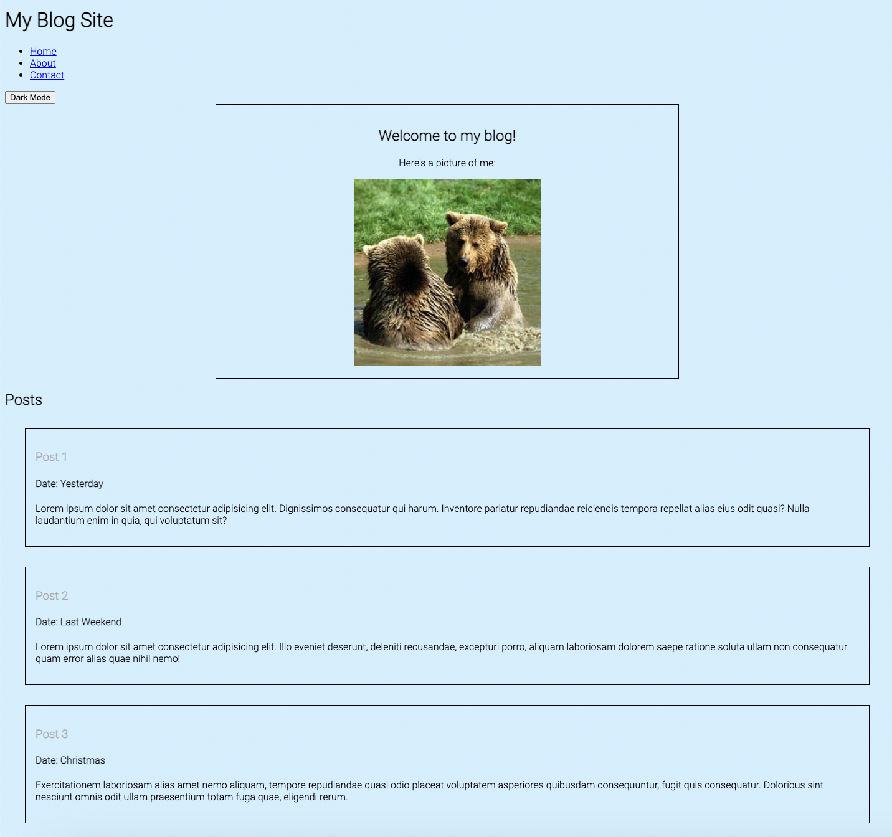

# JavaScript Blogsite Exercise

Exercise for BNTA Week 8, Monday afternoon (JavaScript module).

Tasks:

1. Add Dark/Light mode toggle button
2. Add Favourite button, that modifies the CSS by highlighting as a favourite when clicked
3. Add Form, to be able to submit new post

